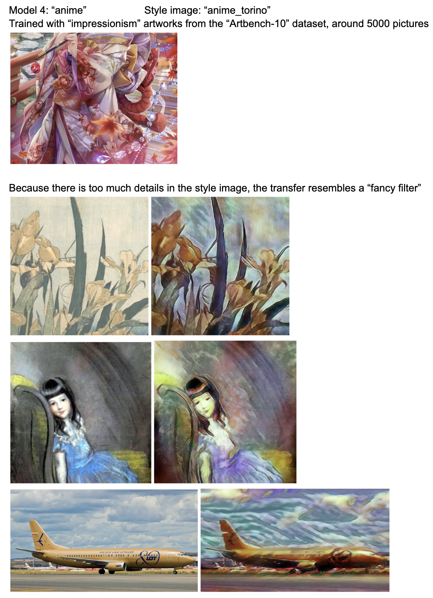

# UofM EECS 351 p2GAN Implementation
For Neural Style Transfer: https://github.com/ziyang-ning/Neural_Style_Transfer

## Sources & Authors
Based on Paper linked: https://arxiv.org/abs/2001.07466 

Original Author: Zhentan Zheng, Jianyi Liu

Original Code: https://github.com/i-evi/p2gan

Editor: Jason Ning

The original code was written in TensorFlow 1.X and was a python script. I have edited the code to work with TensorFlow 2 and made it into a python notebook file for easy use/access. 

I do not own any of the code. Please contact me if this repository needs to be removed. This project was for learning purposes only.

## Purpose
Compare GAN style transfer with Neural Style Transfer

Learn TensorFlow and Singal Processing techniques

## Dependencies
TensorFlow 2, instructions: https://www.tensorflow.org/install/pip

OpenCV2: `pip install opencv-python`

For Mac instructions: https://github.com/jeffheaton/t81_558_deep_learning/blob/master/install/tensorflow-install-mac-metal-jan-2023.ipynb

Import NoteBook: `pip install import-ipynb`

TF_Slim: `pip install --upgrade tf_slim`

If you still have dependency problems after these commands, try running the commands inside the Anaconda command prompt.

Download VGG (second link) in the same directory as everything else:
https://mega.nz/#!YU1FWJrA!O1ywiCS2IiOlUCtCpI6HTJOMrneN-Qdv3ywQP5poecM

(from this https://github.com/machrisaa/tensorflow-vgg)

## How to Use
Modify the `train.ipynb` for training a new model

more specifically:

-- change the `MODEL_SAVE_PATH` parameter to the folder that you want your model to be saved at

-- change the `STYLE_IMG` parameter to the style desired for your model to transfer other images to

-- change the `TRAINSET_PATH` parameter to the folder that you have all of your training images in, training with around 6-10k images are prefered.

** IMPORTANT ** 

THIS IS HOW YOU CAN TEST THE MODEL WE TRAINED:

Run the `render.ipynb` for rendering new images with a specific model

more specifically:

-- change the `MODEL_SAVE_PATH` parameter to the folder of your model

-- change the `OUT_PATH` parameter to the folder where you want the generated images to be

-- change the `IMGSRC_PATH` parameter to the folder where you have all of your input image to the system, the images that you want to perform the style transfer

The models that we trained for this project are in the /available_models/ directory, named: `Jason_Test_Model`, `space_2`, `morncolour_whale`, `epch1`, and `anime`

Feel free to choose any of them.

For more on what the parameters do, please check out the original code repo.

# Known Issues
If you interrupted the Kernel of the `Train.ipynb` file while it was training, 
and tries to the train code block again, it will show the error below: `ValueError: Variable generator/enc_0_dw/depthwise_weights already exists, disallowed. Did you mean to set reuse=True or reuse=tf.AUTO_REUSE in VarScope?`

To fix this, you just need to restart the Kernel. 

# Training Data
We have tried training on the "impressionism" artworks from the `Artbench-10` 
and all the pictures from the `PASCAL VOC 2007`, links are below. If you want to train your own model, 
you have to have the dataset downloaded yourself too.

`PASCAL VOC 2007`: https://www.kaggle.com/datasets/zaraks/pascal-voc-2007

`Artbench-10`: https://www.kaggle.com/datasets/alexanderliao/artbench10

# Results:
The output images can be found in the `rendered_images` directory

The saved models can be found in the `available_models` direcotry

